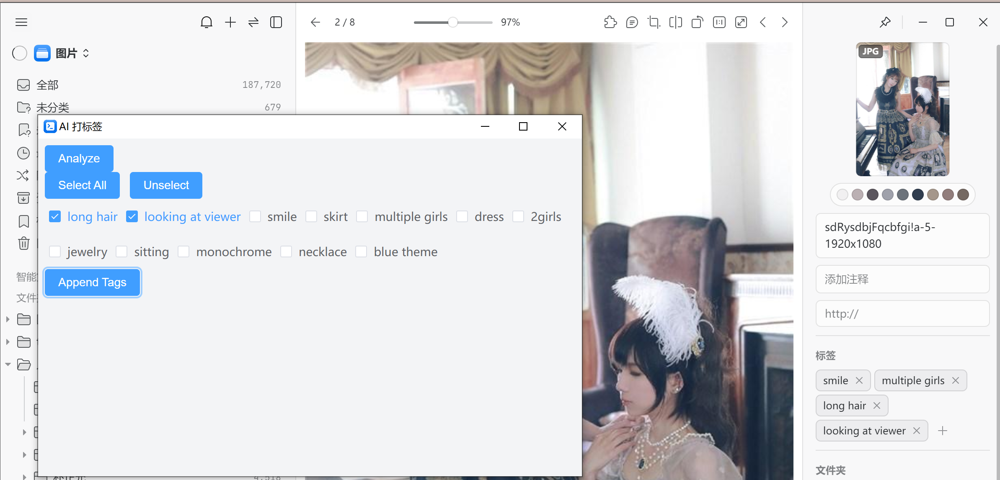
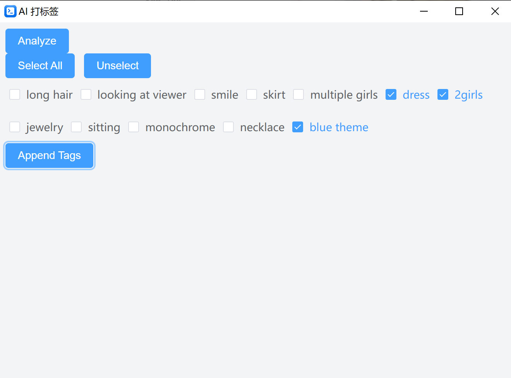
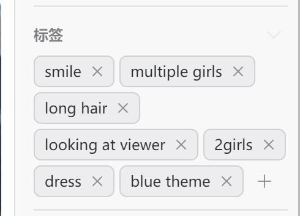

[English](README.md) [简体中文](README_zh_CN.md)
# Eagle AI Tagger (WIP)

A custom plugin for Eagle to generate tags by using [wd-swinv2-tagger-v3](https://huggingface.co/SmilingWolf/wd-swinv2-tagger-v3/)


## Prerequisite
Make sure you installed
1. Nodejs
2. git
3. Eagle 4 build1

## Install
1. run command
```commandline
git clone https://github.com/jtydhr88/eagle-ai-tagger
```
2. go inside the repo
3. run command
```commandline
node install
```
4. download the following model files, and place them into **eagle-ai-tagger/model** folder:
   1. [model](https://huggingface.co/SmilingWolf/wd-swinv2-tagger-v3/resolve/main/model.onnx)
   2. [selected_tags.csv](https://huggingface.co/SmilingWolf/wd-swinv2-tagger-v3/resolve/main/selected_tags.csv)
5. open Eagle, and **menu -> Plugin -> Developer options -> Import Local Project**, then select this repo

## How to use
1. select one image
2. right click -> Plugin -> AI Tagger 
3. first, click Analyze, then it will take some time (a few seconds) to load AI model, and analyze your image.
4. if generating successful, you will see the tag list
5. then you can select what you want (or select all)
6. click Append Tags
7. the tags will be added to image now 

## TODO
* [ ] Tag Translation
  * you may notice, I am using [wd-swinv2-tagger-v3](https://huggingface.co/SmilingWolf/wd-swinv2-tagger-v3/), which is popular in the stable diffusion community for generating prompts. While we can use "prompt" as tags in Eagle, it's better to translate them into the user's language. For example, "1girl" could be translated to "一个女孩" and "smile" to "微笑". I may translate the tags to Chinese later, but since the full list has more than 10,000 tags, it will take time. 
* [ ] i18n support
  * Currently, I have added support for English and Chinese. Please open an issue if you need another language.
* [ ] Support for Multiple Image Selection
  * At the moment, the tool only supports one image at a time. However, it would be better to support selecting multiple images.
* [ ] better UI&UX
  * Since I have only implemented the basic functionality so far, I might improve the UI and UX later, such as other themes.
* [ ] publish to [Eagle official plugin center](https://community-en.eagle.cool/plugins)
  * I will discuss this further in the Q&A section.

## Q&A
1. Q: Why do I need to download some development tools, such as NodeJS and Git, to use it?  
A: The main reason is that, in order to load the AI model, it requires onnxruntime-node, which I could only get working using this approach. While there is a web version of onnxruntime (which the Eagle official plugin, ai-eraser, uses), I encountered errors when trying to load the AI model I'm using and couldn't resolve them. Therefore, we need to use these development tools for setup at this time.
2. Q: Why isn't it published in the Eagle official plugin center?  
A: Due to the issues mentioned in the first question, I don't think Eagle's official plugin center would accept it if I published it. If I can resolve these issues in the future, I will consider publishing it.
3. Q: What is the difference between this and [Eagle-Plugin-AI-Tags](https://github.com/GOvEy1nw/Eagle-Plugin-AI-Tags)
A: in [Eagle-Plugin-AI-Tags](https://github.com/GOvEy1nw/Eagle-Plugin-AI-Tags), GOvEy1nw uses an LLM (either online or local) to generate tags, which may require additional steps like applying an API key, net connection, or cost a little. Here, I use a local model, which, as I mentioned, has been proven to generate prompts in the stable diffusion community.
4. Q: Why doesn't Eagle do this officially, and why you?
A: I do it because I need this feature personally, and I don't know why Eagle not do it. They might be working on this feature. If Eagle implements this feature in the future, I will archive this repository at that time.

## Credit & Thanks
1. [wd-swinv2-tagger-v3](https://huggingface.co/SmilingWolf/wd-swinv2-tagger-v3/)