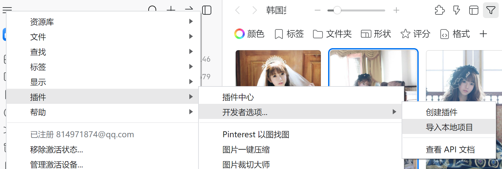

[English](README.md) [简体中文](README_zh_CN.md)
# Eagle AI 打标签 (WIP)

使用[wd-swinv2-tagger-v3](https://huggingface.co/SmilingWolf/wd-swinv2-tagger-v3/)对Eagle中的进行自动标签生成。


## 前置条件
确保你本地已经安装：
1. Nodejs
2. git
3. Eagle 4 build1

## 安装
1. 运行命令
```commandline
git clone https://github.com/jtydhr88/eagle-ai-tagger
```
2. 进入到文件夹中
3. 运行命令
```commandline
npm install
```
4. 下载下面两个文件, 然后把它们放到 **eagle-ai-tagger/model** 文件夹中:
   1. [model](https://huggingface.co/SmilingWolf/wd-swinv2-tagger-v3/resolve/main/model.onnx)
   2. [selected_tags.csv](https://huggingface.co/SmilingWolf/wd-swinv2-tagger-v3/resolve/main/selected_tags.csv)
5. 打开Eagle, 然后以此 **菜单 -> 插件 -> 开发者选项 -> 导入本地项目**, 选择这个文件夹

## 使用
1. 选择一张图片
2. 右键 -> 插件 -> AI 打标签 
3. 首先, 点击**分析**按钮, 然后等待一定时间（几秒或十几秒）去加载AI模型, 同时分析你的图片.
4. 如果成功的话，你会看到生成的标签列表
5. 然后你可以选择你想要的标签（或是选择全部）
6. 点击**追加标签**按钮
7. 选择标签这时应该就被加到你的图片上了 

## TODO
* [x] Tag翻译
  * 你可能注意到了，我使用了 [wd-swinv2-tagger-v3](https://huggingface.co/SmilingWolf/wd-swinv2-tagger-v3/), 它在stable diffusion的社区中常被用于生成提示词. 我们当然可以用”提示词“作为标签在Eagle中使用, 但是如果作为标签的话，最好将它们翻译成用户对应的语言. 例如, "1girl" 对应 "一个女孩" 或 "smile" to "微笑". 我之后可能会把它们翻译成中文, 但是完成的列表有超过一万个, 这会花些时间. 
* [ ] 多语言支持
  * 目前, 我只添加了英语和简体中文的支持. 如果你想要其他语言的话请开个issue。
* [ ] 支持同时为多张图片生成标签
  * 当前只支持为一张图片生成标签。最好可以支持多张图片同时生成。
* [ ] 更好的界面和用户体验
  * 因为我目前只完成了最基础的功能,我之后可能会改进界面和用户体验，比如说其他主题。
* [ ] 发布到 [Eagle官方的插件中心](https://community-en.eagle.cool/plugins)
  * 我会在常见问题中讨论这个.

## 常见问题
1. Q: 我为什么一定需要下载一些开发工具（比如说NodeJS和Git）才能使用它？  
A: 最主要的原因是, 为了加载需要AI模型, 我们需要一个叫做onnxruntime-node的东西, 目前来说，我只能让它在这种环境中可用. 其实onnxruntime是用web版本的 (Eagle官方就用它实现了AI橡皮擦插件), 但是当我尝试使用这个库去加载我需要AI模型的的时候，我遇到了一个我目前没有办法解决的问题，这是为什么我们需要这些开发者工具才能使用的原因。
2. Q: 为什么不把它发布到Eagle官方的插件中心？  
A: 因为第一个问题的原因，我不认为Eagle官方会接受它即使我尝试去发布，如果之后把第一个问题解决，我应该会考虑发布。
3. Q: 这个和另一个插件[Eagle-Plugin-AI-Tags](https://github.com/GOvEy1nw/Eagle-Plugin-AI-Tags)有什么区别？
A: 在[Eagle-Plugin-AI-Tags](https://github.com/GOvEy1nw/Eagle-Plugin-AI-Tags), GOvEy1nw 使用了大语言模型(远端或是本地)去生成标签, 这可能会需要一些额外的步骤，例如申请API key，网络传输，或是有些花费. 我这里选择了纯的本地AI模型，就像之前提到的，它在stable diffusion社区中已经证明了它可以很好的生成提示词。
4. Q: 为什么Eagle官方不做这个，而是你？
A: 我做这个功能注意是我自己很需要这个功能，所以我就做了，我不太清楚为什么官方没有去做，Eagle可能在未来推出官方的实现，那时我会将这个库给归档。

## Credit & Thanks
1. [wd-swinv2-tagger-v3](https://huggingface.co/SmilingWolf/wd-swinv2-tagger-v3/)
